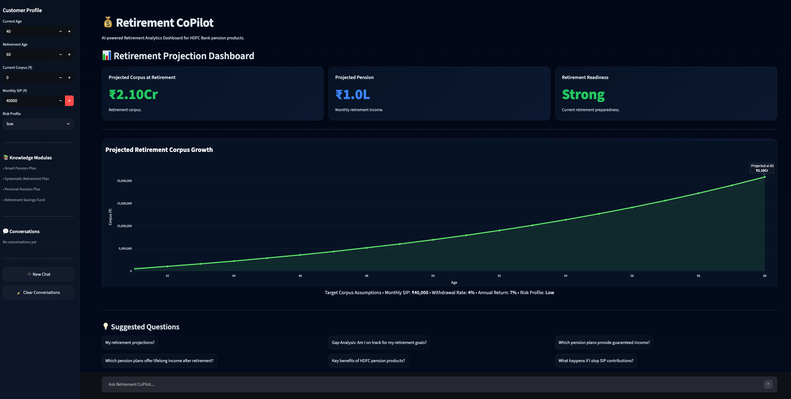
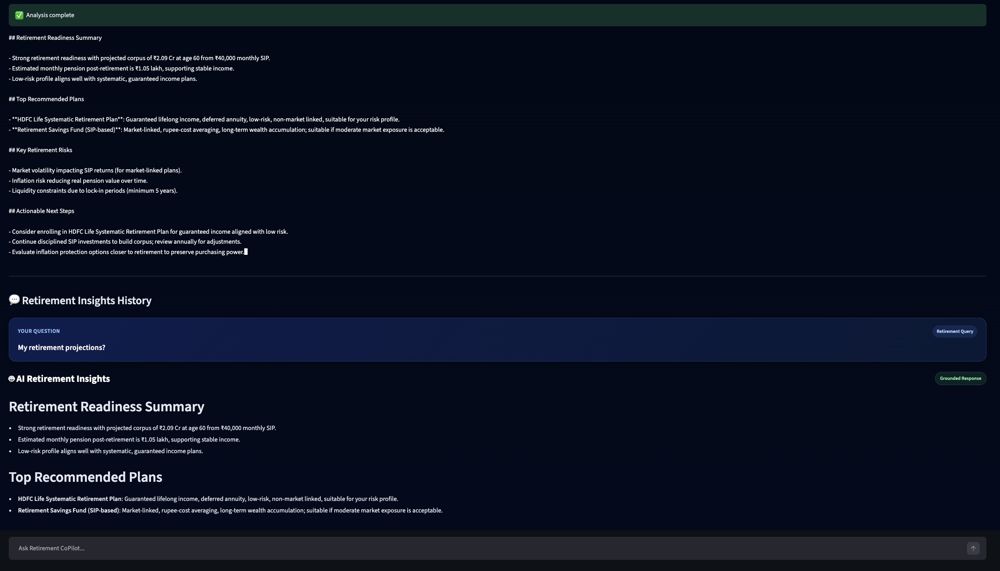
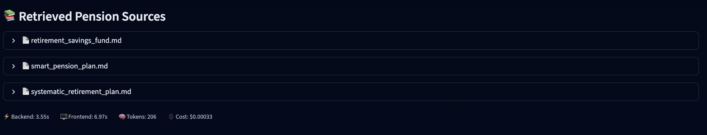
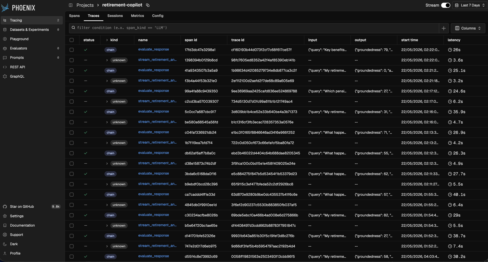
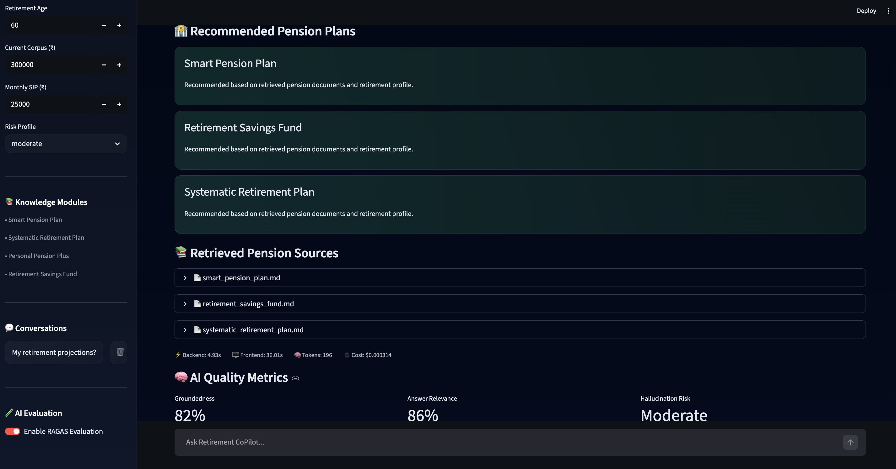
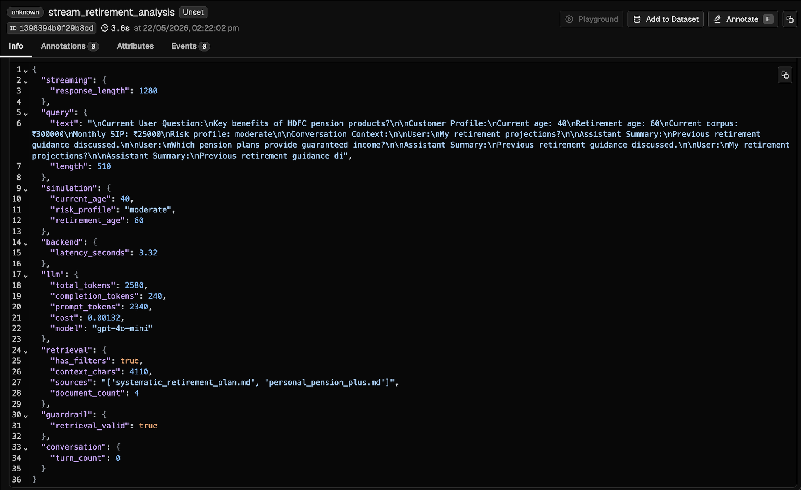
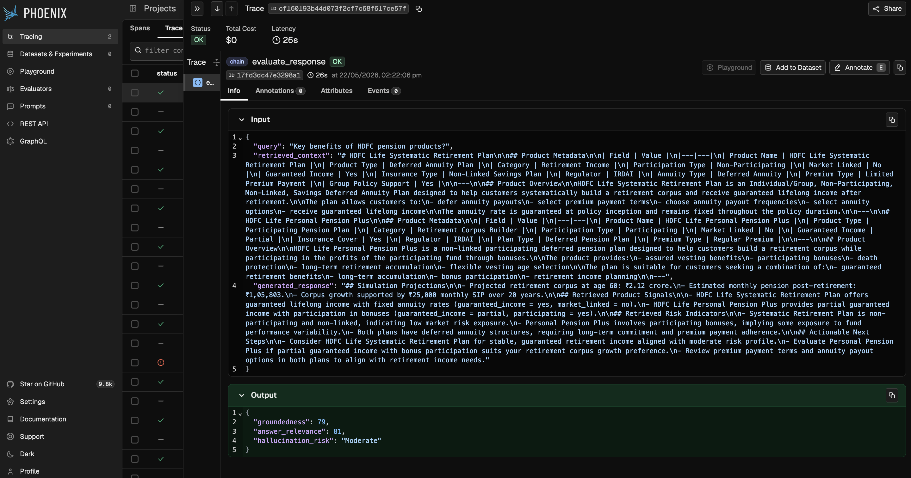

# 💰 Retirement CoPilot

Enterprise-grade AI-powered Retirement Planning Assistant built using Streamlit, FastAPI, Retrieval-Augmented Generation (RAG), ChromaDB, OpenAI LLMs, OpenTelemetry, Arize Phoenix, and RAGAS evaluation pipelines.

Retirement CoPilot enables users to:
- simulate retirement outcomes
- analyze retirement projections
- retrieve pension intelligence using semantic search
- generate grounded AI retirement insights
- monitor AI quality through observability and evaluation telemetry

The platform combines:
- RAG-based pension intelligence
- AI guardrails
- hallucination reduction
- OpenTelemetry tracing
- Phoenix observability
- RAGAS-based groundedness evaluation

within a modular enterprise-style AI architecture.

---

# 🚀 Live Demo

https://retirement-copilot-phoenix.streamlit.app

---

# 📸 Screenshots

## Dashboard Overview



---

## AI Retirement Insights



---

## Grounded Pension Sources



---

## Phoenix AI Observability Dashboard



---

## RAGAS Evaluation Metrics



---

## AI Telemetry & Attributes Monitoring



---

## Phoenix Response Evaluation



# ✨ Features

## AI Retirement Analytics

- AI-generated retirement projections
- Grounded pension recommendations
- Retirement risk analysis
- Context-aware retirement insights
- Evidence-based AI responses

---

## Retirement Simulation Engine

- SIP-based corpus projections
- Risk-adjusted retirement simulations
- Monthly retirement income estimation
- Projection-driven retirement analytics

---

## RAG-Powered Pension Intelligence

- Retrieval-Augmented Generation (RAG)
- Semantic pension search
- ChromaDB vector retrieval
- Retrieval-grounded AI responses
- Context-aware recommendation generation

---

## AI Observability & Telemetry

- OpenTelemetry instrumentation
- Arize Phoenix observability
- AI workflow tracing
- Retrieval telemetry
- Token and cost analytics
- Latency monitoring
- Response analytics
- Streaming AI tracing

---

## RAGAS Evaluation & Hallucination Monitoring

- Groundedness evaluation
- Answer relevance scoring
- Hallucination risk classification
- AI quality telemetry
- Prompt-governed grounding optimization
- Evidence-first response evaluation

---

## AI Guardrails

- Intent classification
- Retrieval validation
- Grounded response enforcement
- Hallucination reduction constraints
- Evidence-bound recommendation generation

---

## FastAPI Backend Services

- Modular REST API architecture
- Decoupled orchestration layer
- Simulation service endpoints
- AI analysis service integration
- Enterprise-ready backend separation

---

## Interactive Dashboard

- Enterprise-style Streamlit UI
- Retirement analytics cards
- Corpus growth visualization
- AI-powered retirement assistant
- AI quality metrics dashboard

---

# 🏗️ Architecture

## High-Level Architecture

```text
┌──────────────────────────┐
│      Streamlit UI        │
│ Dashboard + Chat Layer   │
└────────────┬─────────────┘
             │
             ▼
┌──────────────────────────┐
│      FastAPI Backend     │
│ API Gateway + Routing    │
└────────────┬─────────────┘
             │
     ┌───────┴───────────────┐
     ▼                       ▼
┌──────────────┐    ┌────────────────┐
│ Simulation   │    │ RAG Retrieval  │
│ Service      │    │ Service        │
└──────────────┘    └────────────────┘
                             │
                             ▼
                    ┌────────────────┐
                    │ Chroma Vector  │
                    │ Database       │
                    └────────────────┘
                             │
                             ▼
                    ┌────────────────┐
                    │ Pension Docs   │
                    │ Embeddings DB  │
                    └────────────────┘
                             │
                             ▼
                    ┌────────────────────┐
                    │ LLM Inference Layer│
                    │ OpenAI GPT-4.1 Mini│
                    └────────────────────┘
                             │
                             ▼
                    ┌────────────────────┐
                    │ RAGAS Evaluation   │
                    │ Groundedness QA    │
                    └────────────────────┘
                             │
                             ▼
                    ┌────────────────────┐
                    │ Phoenix + OTEL     │
                    │ AI Observability   │
                    └────────────────────┘
```

---

# 🧠 Tech Stack

## Frontend
- Streamlit
- Plotly

## Backend
- FastAPI
- Python 3.11

## AI / LLM
- OpenAI GPT-4.1 Mini
- LangChain

## Vector Database
- ChromaDB

## Embeddings
- OpenAI Embeddings

## AI Observability
- OpenTelemetry
- Arize Phoenix

## AI Evaluation
- RAGAS

## DevOps / Tooling
- GitHub Actions CI/CD
- Docker-ready architecture

---

# 📊 AI Quality Improvements

- Improved RAG groundedness score by ~28% using evidence-bound prompting and retrieval-constrained response generation
- Implemented hallucination risk monitoring using RAGAS evaluation pipelines
- Added 15+ custom telemetry attributes for AI workflow diagnostics
- Integrated OpenTelemetry + Phoenix for end-to-end AI tracing and observability
- Added token usage, latency, retrieval diagnostics, and AI quality telemetry

---

# 📂 Project Structure

```text
retirement-copilot/
│
├── app/
│   ├── agents/
│   ├── api/
│   ├── evaluation/
│   ├── observability/
│   ├── rag/
│   ├── docs/
│   ├── ui/
│   ├── simulations/
│   ├── guardrails/
│   ├── utils/
│   └── main.py
│
├── backend/
│   ├── services/
│   └── api/
│
├── chroma_db/
├── screenshots/
├── .github/workflows/
├── requirements.txt
└── README.md
```

---

# 🔍 Core Components

## Simulation Engine

Projects retirement outcomes using:
- current age
- retirement age
- SIP contribution
- risk profile
- projected growth assumptions

---

## RAG Retrieval System

Uses:
- OpenAI embeddings
- Chroma vector database
- semantic pension retrieval
- grounded retrieval pipelines

---

## AI Orchestrator

Handles:
- prompt engineering
- context injection
- conversation continuity
- evidence-grounded response generation

---

## AI Observability Layer

Implements:
- OpenTelemetry tracing
- Phoenix instrumentation
- semantic chain tracing
- retrieval telemetry
- token/cost monitoring
- latency analytics

---

## AI Evaluation Layer

Implements:
- RAGAS groundedness evaluation
- answer relevance scoring
- hallucination risk analysis
- telemetry-driven prompt optimization

---

## Guardrails

Implements:
- retrieval validation
- hallucination reduction
- grounded recommendation enforcement
- evidence-bound AI response generation

---

# ⚙️ Installation

## Clone Repository

```bash
git clone https://github.com/wilsonfebin/retirement-copilot.git

cd retirement-copilot
```

---

## Create Virtual Environment

```bash
python -m venv venv
```

### macOS/Linux

```bash
source venv/bin/activate
```

### Windows

```bash
venv\Scripts\activate
```

---

## Install Dependencies

```bash
pip install -r requirements.txt
```

---

# 🔐 Environment Variables

Create `.env`

```env
OPENAI_API_KEY=your_openai_api_key

ENABLE_PHOENIX=true
```

---

# 🧱 Build Vector Database

```bash
python -m app.rag.ingestion
```

This generates:

```text
chroma_db/
```

---

# ▶️ Run Application

## Streamlit App

```bash
streamlit run app/main.py
```

---

## Optional: Run Phoenix Locally

```bash
docker run -p 6006:6006 arizephoenix/phoenix:latest
```

Phoenix Dashboard:

```text
http://localhost:6006
```

---

# 📊 Example Capabilities

- “Am I on track for retirement?”
- “Which pension plans provide guaranteed income?”
- “What retirement corpus will I need?”
- “Compare guaranteed vs market-linked pension products.”
- “What happens if I stop SIP contributions?”

---

# 🔒 AI Safety & Grounding

Retirement CoPilot enforces:
- retrieval-grounded responses
- evidence-bound pension recommendations
- hallucination reduction
- grounded AI orchestration
- controlled retirement guidance generation

The assistant does NOT:
- invent pension features
- fabricate returns or guarantees
- generate unsupported tax assumptions
- use external financial knowledge
- produce unsupported retirement conclusions

---

# 🚀 Deployment

## Streamlit Cloud

1. Push repository to GitHub
2. Create Streamlit Cloud app
3. Select deployment branch
4. Configure secrets:

```toml
OPENAI_API_KEY="your_key"
```

5. Deploy

---

# 🛣️ Future Enhancements

- Multi-user authentication
- Persistent chat memory
- Portfolio allocation engine
- Monte Carlo retirement simulations
- Kubernetes deployment
- Prometheus + Grafana monitoring
- Terraform infrastructure provisioning
- SaaS multi-tenant AI architecture

---

# 📌 Notes

This project is designed as:
- enterprise AI architecture showcase
- observable RAG platform prototype
- AI reliability engineering reference
- GenAI observability demonstration
- retirement analytics AI assistant

---

# 👨‍💻 Author

Febin Wilson

GitHub:
https://github.com/wilsonfebin

LinkedIn:
https://www.linkedin.com/in/febinwilson

---

# 📄 License

MIT License